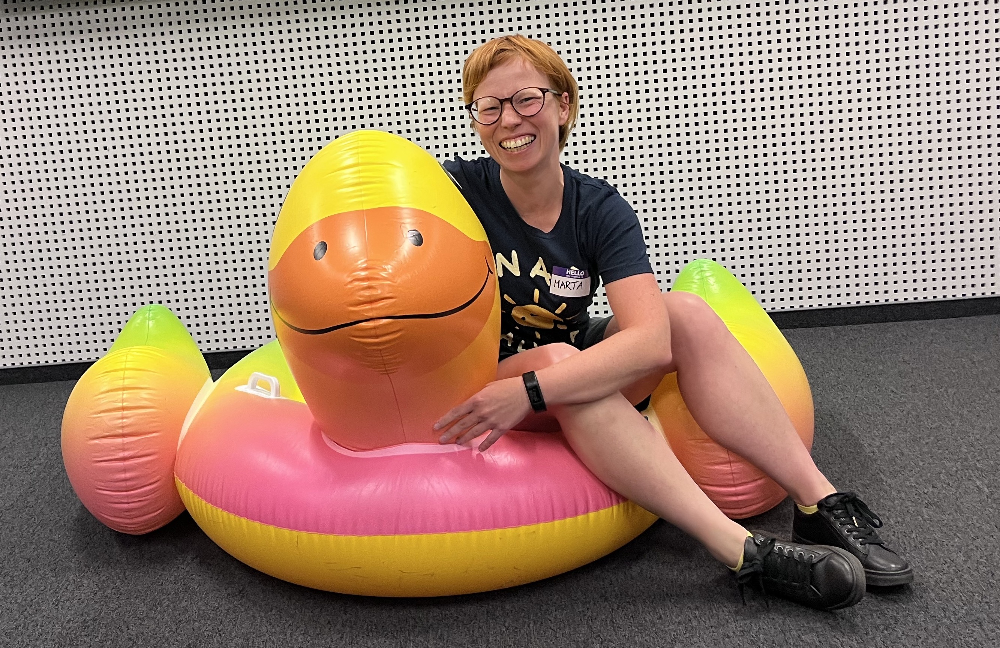

# Some programming exercises

In this project direcotry are exercises from my "personal project": `back to programming in 2023`. 😄

It's "a little bit of everything repository", where I put my code from learning, to see my own progress and all stuff that I learned. I know that it is chaotic, and has some polish names, but for now it is important repository for me. 😉

You will find here:

- java script exercises
- algorithm exercises
- testing exercises
- css exercises
- react exercises

In this project directory is also code from workshops that I took part:

- girlsjs - workshop about cookies

